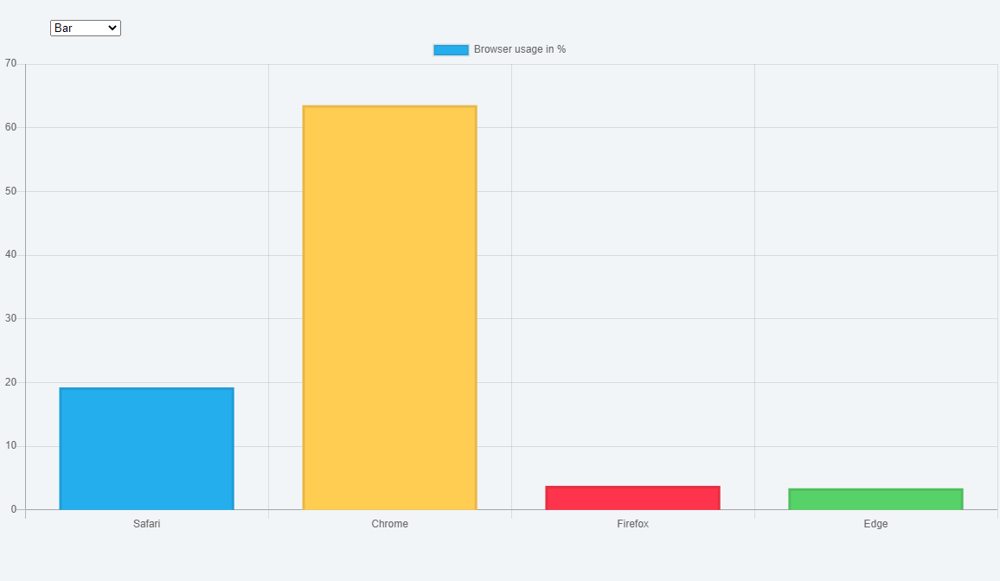

<div align="center">
  <h1>Usage share of popular browsers</h3>
  <p>
    Charts that summarize the usage share of popular browsers
    <br />
    <a href="https://inventory-ten.vercel.app/"><strong>Website »</strong></a>
  </p>
</div>

<!-- TABLE OF CONTENTS -->
<details open="open">
  <summary>Table of Contents</summary>
  <ol>
    <li>
      <a href="#screenshots">Screenshots</a>
    </li>
    <li>
      <a href="#developed-with">Developed With</a>
    </li>
    <li>
      <a href="#getting-started">Getting Started</a>
      <ul>
        <li><a href="#installation">Installation</a></li>
        <li><a href="#usage">Usage</a></li>
      </ul>
    </li>
    <li><a href="#authors">Authors</a></li>
    <li><a href="#license">License</a></li>
  </ol>
</details>

## Screenshots



## Developed With

- [Parcel](https://parceljs.org/)

## Getting Started

These instructions will get you a copy of the project up and running on your local machine for development and testing purposes.

### Installation

Follow the following steps to get development environment running.

1. Clone 'web-browser-usage-2020' repository from GitHub

   ```sh
   git clone https://github.com/marekzelinka/web-browser-usage-2020.git
   ```

1. Install node modules

   ```sh
   cd web-browser-usage-2020
   npm install
   ```

### Usage

- Run development server
  ```sh
  npm run dev
  ```
- Build
  ```sh
  npm build
  ```

---

## Authors

- **Marek Zelinka** - _Initial work_ - [marekzelinka](https://github.com/marekzelinka)

## License

[](http://badges.mit-license.org)

- **[MIT license](http://opensource.org/licenses/mit-license.php)**
- Copyright 2019 © <a href="https://github.com/marekzelinka" target="_blank" rel="noopener noreferrer">Marek Zelinka</a>
